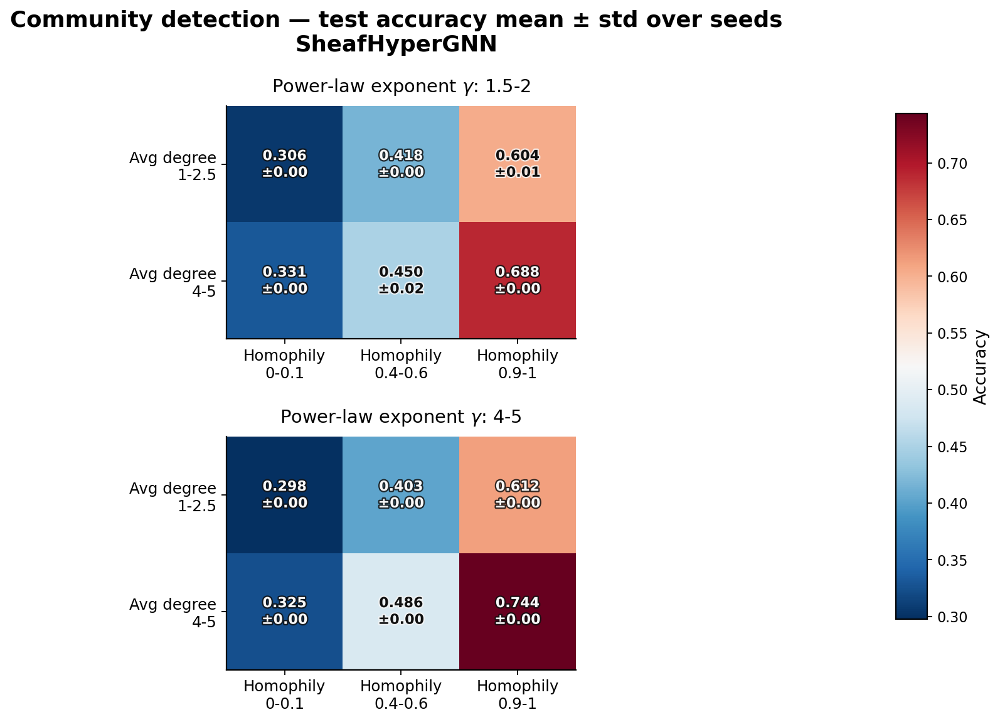
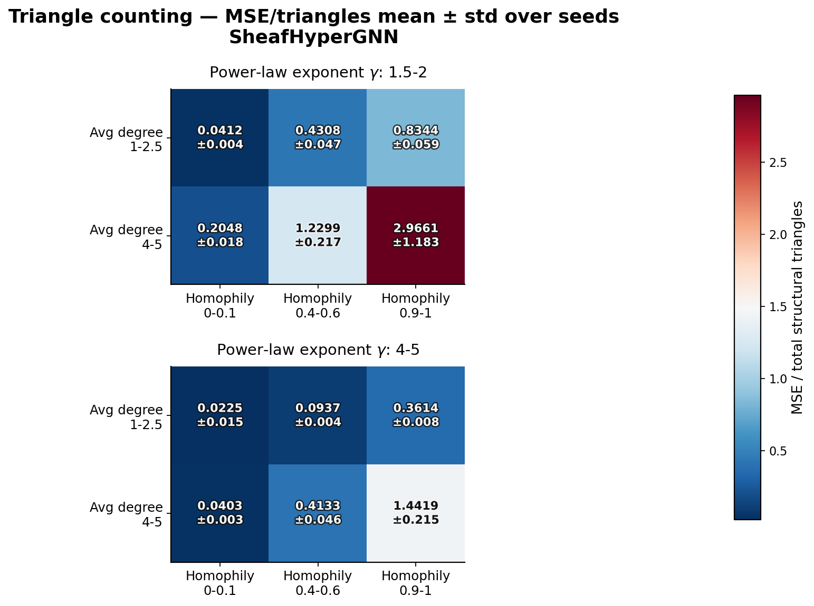

# Track 2 — SheafHyperGNN Submission

## Track

Track 2 — Topological Neural Networks (TNNs)

## Team Name

s/pairwise/ho

## Model

Sheaf Hypergraph Networks (SheafHyperGNN)

## Status

Ready for review

## Summary

This PR adds a TopoBench-native implementation of SheafHyperGNN (linear,
diagonal variant) from Duta et al., "Sheaf Hypergraph Networks" (NeurIPS 2023),
for the 2026 TDL Challenge.

The idea from the paper: instead of a 0/1 incidence matrix, each
(node, hyperedge) pair gets a learned `d×d` restriction map, and each node and
hyperedge carries a `d`-dimensional stalk. Those maps define a cellular sheaf
over the hypergraph, and its sheaf Laplacian takes the place of the usual
hypergraph Laplacian in the diffusion step. No externally supplied hyperedge
features are required: the model initializes them from node features, then
predicts the restriction maps from features. Sheaf Hypergraph Networks are
designed to resist over-smoothing by enforcing agreement in the transformed
stalk space rather than directly on the node features.

Key hyperparameters for the submitted implementation (matching the reference
`SheafHyperGNNDiag` example):

- diagonal restriction maps, stalk dimension `d=6`
- `tanh` activation on the restriction maps
- symmetric degree normalization
- averaged hyperedge initialization
- `cp_decomp` restriction-map predictor
- configured hidden width `256`, dropout `0.7`

The official challenge evaluator overrides every compatible feature encoder to
width `64`; because this model derives its hidden width from the encoder, the
reported GraphUniverse runs use hidden width `64`.

## Adaptations from the reference implementation

The backbone implements the same diagonal restriction-map builder and linear
sheaf diffusion as the official repository, with changes required by
TopoBench's modular and batched execution:

- The reference accepts a PyG `Data` object; the backbone accepts TopoBench's
  `x_0` and `incidence_hyperedges` arguments through `HypergraphWrapper`.
- The reference constructs sparse `H`, `B^-1`, and `D^-1` matrices and uses
  `torch_sparse` matrix products. The backbone applies the identical
  `I + M - 2 blockdiag(M)` operator with gather/scatter operations. For
  diagonal restriction maps, the block-diagonal term is computed directly as
  `alpha^2 B^-1 x`, so memory scales with the number of incidences rather than
  `num_nodes * num_hyperedges`.
- The reference caches hyperedge features because it trains one fixed graph.
  The backbone recomputes them per forward pass so a later TopoBench mini-batch
  cannot receive stale features.
- The incidence-matrix width supplies the number of hyperedges, which also
  handles isolated hyperedges that are absent from the nonzero index list.
- TopoBench's standard readout replaces the original `lin2` classifier and
  provides the task-specific node- or graph-level prediction head. Unlike the
  reference `lin2`, the standard readout includes a learnable bias. The
  backbone therefore returns the uncompressed `d * hidden_channels` node
  representation consumed by the readout.
- The wrapper residual is disabled because the reference configuration uses
  `residual_HCHA=False`.
- The implementation uses ELU between layers to follow the official code. The
  paper presents ReLU as the generic activation in Section 3.3; this
  paper/code discrepancy is not introduced by this port.

The submitted file intentionally implements only `SheafHyperGNNDiag`.
Orthogonal, low-rank, general-map, and nonlinear `SheafHyperGCN` variants are
separate architectures and are not part of this PR.

## Implementation Checklist

- [x] Inspect official implementation and paper equations; confirm feasibility.
- [x] Add SheafHyperGNN backbone under `topobench/nn/backbones/hypergraph/sheaf_hypergnn.py`.
- [x] Add Hydra config under `configs/model/hypergraph/sheaf_hypergnn.yaml`.
- [x] Add unit tests.
- [x] Add dense-vs-scatter sheaf diffusion sanity test.
- [x] Update `test/pipeline/test_pipeline.py`.
- [x] Run TopoBench pipeline smoke test with `graph/MUTAG`.
- [x] Run the official GraphUniverse evaluation notebook and add the generated
  `results.json`.
- [ ] Re-run the final implementation on the cluster to record parameter and
  epoch-time fields in the notebook-generated results.

## Validation

- `python -m ruff check topobench/nn/backbones/hypergraph/sheaf_hypergnn.py test/nn/backbones/hypergraph/test_sheaf_hypergnn.py`
- `python -m pytest test/nn/backbones/hypergraph/test_sheaf_hypergnn.py -q`
- `python -m pytest test/pipeline/test_pipeline.py -q`
- Official GraphUniverse sanity check: all 24 task/setting configurations
  passed on an NVIDIA A40.
- Official `run_evaluation.ipynb`: completed all 72 runs and generated
  [`results.json`](results.json).

## Computational Complexity

The official evaluator sets the feature-encoder and backbone hidden width to
`64`. Instantiating the two challenge configurations at that width gives:

| Component | Community detection | Triangle counting |
| --- | ---: | ---: |
| Feature encoder | 2,138 | 2,138 |
| Backbone and hypergraph wrapper | 44,104 | 44,104 |
| Task readout | 7,700 | 385 |
| **Total trainable parameters** | **53,942** | **46,627** |
| Non-trainable parameters | 0 | 0 |

The task totals differ only because community detection predicts 20 classes,
whereas triangle counting has one regression output. These counts were
calculated from the instantiated TopoBench models, without modifying the
notebook-generated `results.json`.

Mean and standard deviation of training epoch time are not present in the
current result payload. They will be measured by rerunning the final code on
the cluster (no timing value yet).

## Results

The official evaluation completed 36 community-detection and 36
triangle-counting runs over seeds `42`, `43`, and `44`. Across all structural
settings and seeds, mean in-distribution community-detection accuracy was
`0.4721`; mean triangle-counting MSE normalized by the number of structural
triangles was `0.6734`. The result payload contains no missing or non-finite
metrics.

### In-distribution results by structural setting

Each cell below shows the mean and standard deviation over seeds `42`, `43`,
and `44`.

Community-detection accuracy increases consistently with homophily. The
highest mean accuracy occurs for high homophily, high average degree, and the
larger power-law exponent range.

Lower values are better for triangle counting. The model performs best in the
larger power-law exponent range and is most challenged by dense,
high-homophily graphs in the smaller exponent range.

## Reference

Duta, I., Cassarà, G., Silvestri, F., & Liò, P.
"Sheaf Hypergraph Networks." *NeurIPS 2023.*

Paper: https://arxiv.org/abs/2309.17116

Official implementation: https://github.com/IuliaDuta/sheaf_HNN
